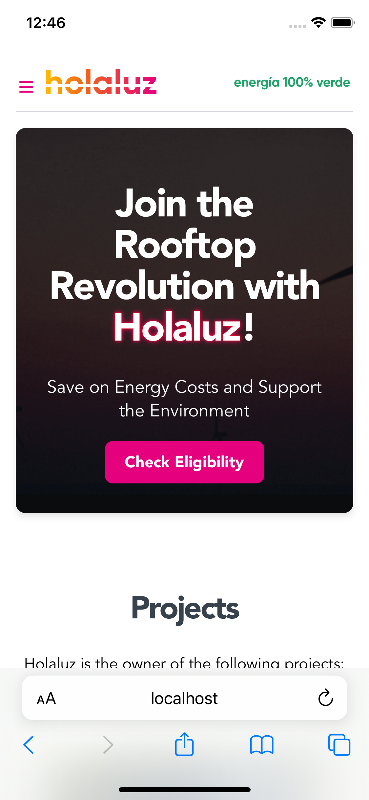
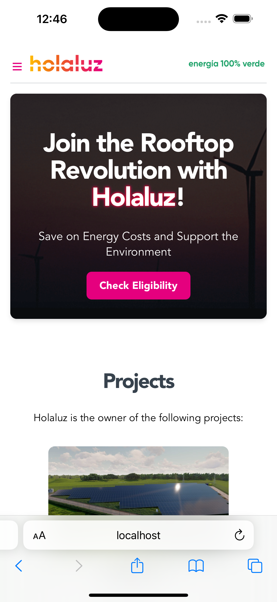

## ✨ Holaluz rooftop revolution landing page ✨

## Overview
This project is a web application designed for Holaluz's new brand product related to our rooftop revolution.
It features a landing page that allows users to check their eligibility for exclusive offers by entering their CUPS (Customer's Unique Provider Signal). The application is built using Vue.js and leverages composables for managing state and logic.

## Features
- CUPS Search: Users can search for their client and supply point information using their CUPS value.
- Eligibility Check: The application determines if a client is eligible for the rooftop revolution based on specific criteria.
- Exclusive Offers: Eligible clients are presented with offers, which vary based on their circumstances and the data provided.
- Responsive Design: The landing page is designed to be user-friendly and responsive across various devices.
## Getting Started
To get started with this project, clone the repository to your local machine and install the dependencies.

```bash
git clone https://your-repository-url.git
cd holaluz
npm install
```

To run the application locally:
```bash
npm run dev
```
This will start the development server, and you can view the application by navigating to http://localhost:5173 in your web browser.

## Key Components
### Hero Section
The hero section is the first thing users see on the landing page. It contains a call-to-action (CTA) button that prompts users to check their eligibility for exclusive offers.
- CTA Button: Clicking this button reveals the client offer section where users can enter their CUPS to find out if they are eligible for any offers.

### Client Offer Section
This section appears when the user clicks the CTA button in the hero section. It includes an input field for the CUPS and displays the client's eligibility and offer details.

### Composables
The application uses two main composables:
1. useClientsAndSupply: Manages the fetching and state of client and supply point information based on the CUPS entered by the user.
2. useEligibility: Determines the eligibility of the client for the rooftop revolution and calculates the type of offer they can receive.

## Usage
### Checking Eligibility
1. Click the "Find Out If You're Eligible" button in the hero section.
2. Enter your CUPS in the input field that appears in the client offer section.
3. Click the search button to submit your CUPS.
4. View your eligibility status and offer details, if applicable.

### Error Handling
- If an invalid CUPS is entered, an error message will be displayed. The error message will disappear once the user starts typing in the search bar again.
- If no client is found for the provided CUPS, a message indicating this will be shown.

## Case Scenarios Covered
- Valid CUPS Entry: Displays client and offer information.
- Invalid CUPS Entry: Shows an error message prompting for a valid CUPS.
- No Client Found: Informs the user that no client was found for the entered CUPS.
- Multiple Searches: Clears previous search results and error messages when a new search is initiated.


## Testing
Every component and composable in the application is tested using the `@testing-library/vue`.
To run the tests in the terminal, use the following command:
```bash
npm run test:unit
```

## Preview
iPhone XS | iPhone 15 Pro Max | iPad_Pro_(12.9-inch)
--- |------| --------|
[](./src/assets/iPhone_Xs.png) | [](./src/assets/iPhone_15_Pro_Max.png) | [.png)](./src/assets/iPad_Pro_(12.9-inch).png)


# Final notes
This project was created by [Joanna M. Smerea](https://www.linkedin.com/in/joannasmerea/) as part of the Holaluz Frontend coding test.
It is intended to showcase the ability to build a web application using Vue.js and to demonstrate the use of composables for managing state and logic.

The application is designed to provide a user-friendly experience and to help users determine their eligibility for exclusive offers related to the rooftop revolution.
Thank you for considering this project, and I look forward to discussing it further with you.
